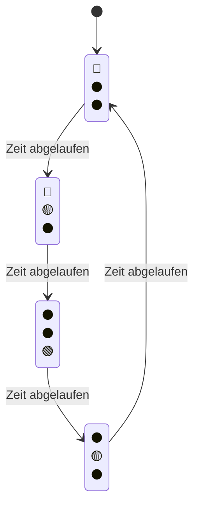

## Über das Exponat

Dieses Exponat wurde entwickelt, um Besuchern einen praktischen Einstieg in die Programmierung von industriellen Controllern zu ermöglichen. Mit dem **WAGO  Compact Controller 100** und der Visual Studio Code Extension **WAGO CC100** bist Du in wenigen Minuten in der Lage, eine echte Industriesteuerung zu programmieren – live und interaktiv!

---

## 🛠️ Technologie

### VS Code Extension: WAGO CC100

Die [WAGO CC100 Extension](https://marketplace.visualstudio.com/items?itemName=WAGO-education.vscode-wago-cc100) für Visual Studio Code ermöglicht es, direkt in Python für den WAGO Controller zu entwickeln:

- **Einsteigerfreundlich** – Keine komplexe IEC-61131-3 Programmiersoftware nötig
- **Moderne Entwicklung** – Programmieren in VS Code mit Python und Syntax-Highlighting
- **Schnelle Bereitstellung** – Code sofort auf dem Controller ausführen
- **Echtzeit IO-Check** – Änderungen live an der Hardware sehen

### WAGO CC100 Python Bibliothek `CC100IO`

Das Projekt nutzt die [`CC100IO`](https://github.com/wago-enterprise-education/wago_cc100_python) Bibliothek – eine Python-Abstraktionsschicht speziell für den WAGO Compact Controller 100 (751-9301). Die Biliothek wird automatisch von der VS Code Extension bereitgestellt und ermöglicht eine einfache Steuerung der Ein- und Ausgänge des Controllers:

**Digitale Signale:**

- `digitalWrite(output, value)` – Digital-Ausgänge schalten (1-4)
- `digitalRead(input)` – Digital-Eingänge auslesen (1-8)
- `digitalReadWait(input, value)` – Auf Zustandsänderung warten (ideal für Ereigniserkennung)

**Analoge Signale:**

- `analogWrite(output, voltage)` – Analog-Ausgänge setzen (0-10000 mV)
- `analogRead(input)` – Analog-Eingänge auslesen

**Zusätzliche Funktionen:**

- `tempRead(input)` – Temperatursensoren (PT1, PT2) auslesen
- `serialWrite/serialReadLine` – RS485-Schnittstelle für externe Geräte
- `delay(time)` – Verzögerungen in Millisekunden

---

## 🚦 Die Ampelsteuerung

Die klassische (verkehrsunabhängige) Ampel folgt einem einfachen Muster:



Eine Ampelanlage besteht dabei aus zwei Ampeln: einer für die Hauptstraße und einer für die Nebenstraße. Die Ampeln wechseln sich ab, sodass immer nur eine Straße grün hat, während die andere rot ist.
Zu beachten ist, dass eine Ampelanlage in der Realität oft durch Sensoren gesteuert wird, um den Verkehr zu optimieren. In diesem Exponat wird jedoch ein fester Zyklus verwendet, um die Programmierung und Logik zu demonstrieren.

---

## 📚 Lernziele

Dieses Projekt ist in **progressive Übungen** aufgeteilt, die Sie Schritt für Schritt durch die Programmierung führen:

### Was Sie lernen

1. **IO-Mapping** – Verstehen, wie Eingänge und Ausgänge auf dem Controller funktionieren
2. **State Machines** – Komplexe Abläufe mit Zuständen und Übergängen verstehen
3. **Python für Embedded Systems** – Echte Industrie-Hardware programmieren

---

## Wie funktioniert es?

### Schritt 1: Extension installieren

Installieren Sie die [WAGO CC100 Extension](https://marketplace.visualstudio.com/items?itemName=WAGO-education.vscode-wago-cc100) in VS Code.

### Schritt 2: Projekt öffnen

Öffnen Sie das Python-Projekt in VS Code bzw. der Extension:

```bash
src/python/vsc-ext-v0.2/
```

### Schritt 3: Demo ansehen oder Aufgaben lösen

- [**Demo**](#-demo): Schauen Sie sich die funktionierende Implementierung an
- [**Aufgaben**](#️-aufgaben): Lösen Sie die Aufgaben schrittweise

### Schritt 4: Am Controller testen

Nutzen Sie die Extension, um Ihren Code direkt auf dem WAGO Controller auszuführen und die Ampel live zu steuern!

---

## 🎨 Demo

Die fertig implementierte Demo finden Sie hier:

📁 [Demo-Programm und Dokumentation](../src/python/vsc-ext-v0.2/demo)

In der Demo sehen Sie ein komplettes, funktionierendes Beispiel mit State Machine für die Ampelsteuerung.

### Standard-Betrieb (Schalter `S1`)

Im Standardbetrieb läuft die Ampel in einem festen Zyklus, der die Haupt- und Nebenstraße abwechselnd grün schaltet, siehe [Ampelsteuerung](#-die-ampelsteuerung).

### Wartungsmodus (Schalter `S2`)

Bei Aktivierung des Wartungsmodus blinkt die Ampel gelb – zum Beispiel bei Wartungsarbeiten oder Störungen.

---

## ✏️ Aufgaben

Detaillierte Anleitung zu den einzelnen Aufgaben finden Sie hier:

### [Aufgabe 1: IO-Mapping](../src/python/vsc-ext-v0.2/exercise1_io_mapping)

**Ziel**: Verstehen Sie, wie Eingänge und Ausgänge auf dem Controller konfiguriert werden. Ordnen Sie die Ampellichter den korrekten Ausgängen zu.

### [Aufgabe 2: Wartungsmodus](../src/python/vsc-ext-v0.2/exercise2_maintenance_mode)

**Ziel**: Implementieren Sie zusätzliche Funktionalität. Wenn Schalter `S2` gedrückt wird, soll die Ampel gelb blinken.

---

## 🔗 Ressourcen

- 📚 [Pythonprojekt Übersicht](../src/python)
- 🐍 [`CC100IO` Python Bibliothek](https://github.com/wago-enterprise-education/wago_cc100_python)
- 🏭 [WAGO GmbH & Co. KG](https://www.wago.com)
- 💻 [WAGO CC100 Extension](https://marketplace.visualstudio.com/items?itemName=WAGO-education.vscode-wago-cc100)

---

## ❓ Fragen?

Dieses Projekt ist Teil des **WAGO Education** Programms. Bei Fragen können Sie sich an die Betreuung vor Ort wenden oder schauen Sie sich die Dokumentation in den Aufgaben-README-Dateien an.

**Viel Erfolg beim Programmieren! 🚀**
