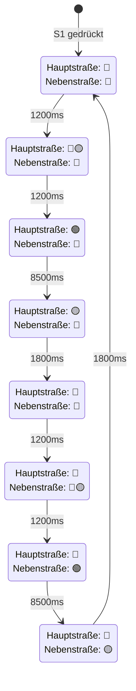
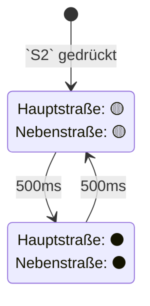
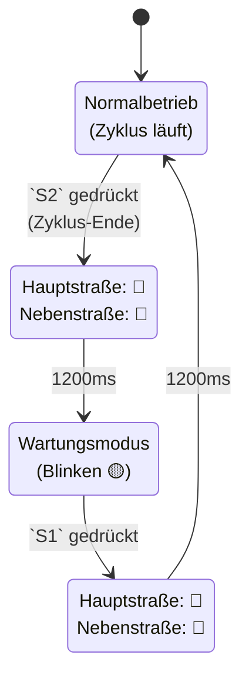

# Ampelanlage

## Kurzbeschreibung Exponat

Der vor Dir stehende Aufbau zeigt die Logik einer Ampelsteuerung mit Haupt- und Nebenstraße. Die Ampel ist ausschließlich über definierte Zeitintervalle gesteuert, es gibt keine Sensoren oder andere Eingaben, die den Ablauf beeinflussen können.

Es gibt zwei Modi: Normalbetrieb und Wartungsmodus.

## Normalbetrieb

Nach dem Start mit Schalter `S1` läuft die Anlage in einem festen Zyklus mit definierten Rot-, Rot-Gelb-, Grün- und Gelbphasen.
Der folgende Zustandsautomat beschreibt die Logik des Normalbetriebs der Ampelsteuerung:

### Zeiten der Phasen

- Rot Phasen: 1200ms
- Rot+Gelb Phasen: 1200ms
- Grün Phasen: 8500ms
- Gelb Phasen: 1800ms

## Wartungsmodus

Der Wartungsmodus wird durch das Drücken von Schalter `S2` aktiviert. In diesem Modus blinkt die Ampel dauerhaft gelb, um Wartungsarbeiten sicher durchführen zu können.

### Blinkverhalten

- Gelb An: 500ms
- Gelb Aus: 500ms

## Übergang zwischen Modi

Der Übergang zwischen Normalbetrieb und Wartungsmodus erfolgt durch das Drücken der entsprechenden Schalter. Der Modus-Wunsch wird zwar sofort registriert, aber der eigentliche Wechsel erfolgt erst nach Abschluss des aktuellen Zyklus (Normalbetrieb) oder Wartungsschritts (Wartungsmodus). Beim Wechsel wird eine sichere Rot-Phase (1200ms) eingeleitet, um einen konfliktfreien Übergang zu gewährleisten.

