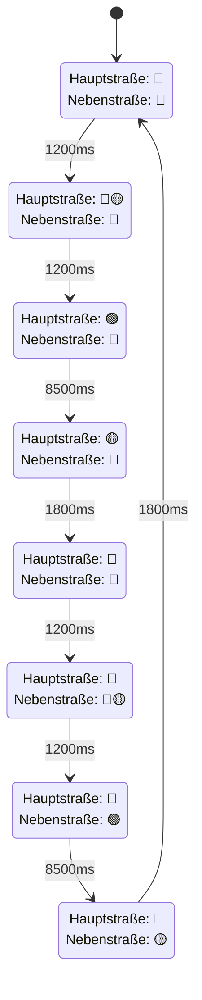

# Aufgabe 1: IO-Mapping der Ampelsteuerung

## Ziel

In dieser Aufgabe wird eine einfache Ampelsteuerung auf dem WAGO CC100 aufgebaut. Der vorhandene Code zeigt bereits den Ablauf der Zustandsmaschine mit `match/case`, aber das IO-Mapping und die Ansteuerung der LEDs sind noch zu vervollständigen.

## Was der Code macht

Die Datei [main.py](main.py) beschreibt einen festen Ampelzyklus für Haupt- und Nebenstraße. Der Automat durchläuft nacheinander diese Zustände:

- `ALL_RED`
- `MAIN_RED_YELLOW`
- `MAIN_GREEN`
- `MAIN_YELLOW`
- `ALL_RED`
- `SIDE_RED_YELLOW`
- `SIDE_GREEN`
- `SIDE_YELLOW`
- `ALL_RED`

Dabei werden die Ausgänge des CC100 direkt angesteuert. Die Funktion `apply_state()` legt fest, welche Lampen in welchem Zustand leuchten. Die Funktion `duration_for_state()` bestimmt die Dauer der einzelnen Phasen. `next_state()` schaltet von einem Zustand in den nächsten weiter.

## Zustandsautomat für die Ampelphasen

## Deine Aufgabe

Vervollständige die Datei [main.py](main.py) an den Stellen, die mit `TODO` markiert sind:

1. Ergänze das Pinmapping der LEDs auf die digitalen und analogen Ausgänge.
2. Implementiere die Funktion `set_lights(...)`, sodass alle Lampen direkt über die CC100IO-API geschaltet werden.
3. Prüfe den Ablauf am echten Controller oder im Debug-Setup.

## Hinweise zum IO-Mapping

Das Pinmapping der LEDs auf die DOs und AOs kann mit der IO-Check-Funktion der Extension herausgefunden werden.

- Über den Controller hovern
- Auf das IO-Check-Symbol klicken
- Die einzelnen Ausgänge manuell ein- und ausschalten

So kannst du herausfinden, welcher Ausgang zu welcher LED gehört.

## CC100IO-Dokumentation

Die Bibliothek und Beispiele findest du hier:

<https://github.com/wago-enterprise-education/wago_cc100_python>

## Fertig, wenn

- das Pinmapping korrekt eingetragen ist
- die Ampel über die CC100IO-Funktionen angesteuert wird
- der Ablauf der Zustandsmaschine korrekt durchläuft
- keine beiden Richtungen gleichzeitig grün zeigen
