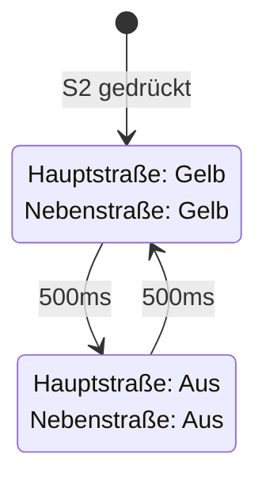
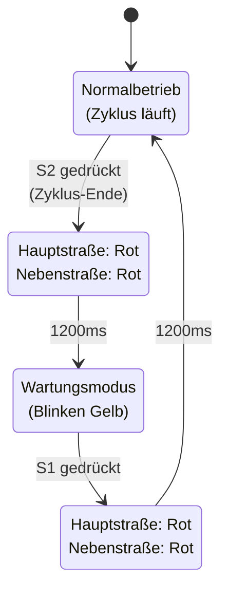

# Aufgabe 2: Wartungsmodus

## Ziel

In dieser Aufgabe wird die Ampelsteuerung um einen **Wartungsmodus** erweitert. Das Programm soll zwei Betriebsmodi unterstützen:

1. **Normalbetrieb** (S1 gedrückt): Vollständiger Ampelzyklus für Haupt- und Nebenstraße
2. **Wartungsmodus** (S2 gedrückt): Beide gelben LEDs blinken kontinuierlich

## Was der Code macht

Die Datei [main.py](main.py) implementiert einen Automaten mit zwei Modi:

- Im **Wartungsmodus** blinken beide gelben Lampen (500ms an/aus-Zyklus) — dies signalisiert: Vorsicht, Wartungsarbeiten!
- Im **Normalbetrieb** läuft die komplette 9-phasige Ampelschaltung (wie in [Aufgabe 1](../exercise1_io_mapping/README.md) beschrieben).
- **Übergänge** sind sicher: Der aktuelle Zyklus wird zu Ende gebracht, dann folgt eine All-Red-Phase (1200ms) als Handover-Sicherung

## Zustandsautomat mit Modi

Der Wartungsmodus wird durch das Drücken von Schalter S2 aktiviert. In diesem Modus blinkt die Ampel dauerhaft gelb, um Wartungsarbeiten sicher durchführen zu können.

## Übergang zwischen Modi

Der Übergang zwischen Normalbetrieb und Wartungsmodus erfolgt durch das Drücken der entsprechenden Schalter. Der Modus-Wunsch wird zwar sofort registriert, aber der eigentliche Wechsel erfolgt erst nach Abschluss des aktuellen Zyklus (Normalbetrieb) oder Wartungsschritts (Wartungsmodus). Beim Wechsel wird eine sichere Rot-Phase (1200ms) eingeleitet, um einen konfliktfreien Übergang zu gewährleisten.

## Deine Aufgabe

Vervollständige die Datei [main.py](main.py) an den Stellen, die mit `TODO` markiert sind:

1. **Wartungsmodus-Zeit definieren**  
   Ergänze die Dauer für die Blinkphasen (an/aus).

2. **Tastereingänge definieren**  
   Bestimme mit dem **IO-Check-Tool** der Extension, auf welchen DI-Eingängen S1 und S2 angeschlossen sind, und definiere:
   - `S1_INPUT = x` (Taster für Normalbetrieb)
   - `S2_INPUT = x` (Taster für Wartungsmodus)

3. **`read_requested_mode()` implementieren**  
   Diese Funktion soll:
   - S2 (Wartungsmodus) mit höherer Priorität abfragen
   - Falls S2 nicht gedrückt: S1 (Normalbetrieb) abfragen
   - Den gewünschten Modus zurückliefern

## Hinweise zum IO-Mapping

Das **IO-Check-Tool** hilft beim Ermitteln der korrekten Eingänge:

- Über den Controller in VS Code hovern
- Auf das **IO-Check-Symbol** klicken
- Die Taster drücken und beobachten, welche DI-Eingänge aktiviert werden

## CC100IO-Dokumentation

Die Bibliothek und Beispiele findest du hier:

<https://github.com/wago-enterprise-education/wago_cc100_python>

Wichtige Funktionen:

- `CC100IO.digitalRead(pin)` — liest einen digitalen Eingang (0 oder 1)
- `CC100IO.digitalWrite(pin, state)` — setzt einen digitalen Ausgang
- `CC100IO.analogWrite(pin, mV)` — setzt einen analogen Ausgang (in Millivolt)

## Fertig, wenn

- Zeit für die Blinkphasen ist definiert
- `S1_INPUT` und `S2_INPUT` sind korrekt zugeordnet
- `read_requested_mode()` liest beide Schalter und liefert den richtigen Modus
- Das Programm startet im Wartungsmodus (gelb blinkt)
- S1 startet den Normalbetrieb
- S2 wechselt nach dem aktuellen Zyklus in den Wartungsmodus zurück
- Beim Übergangswechsel leuchten alle roten LEDs für 1200ms
